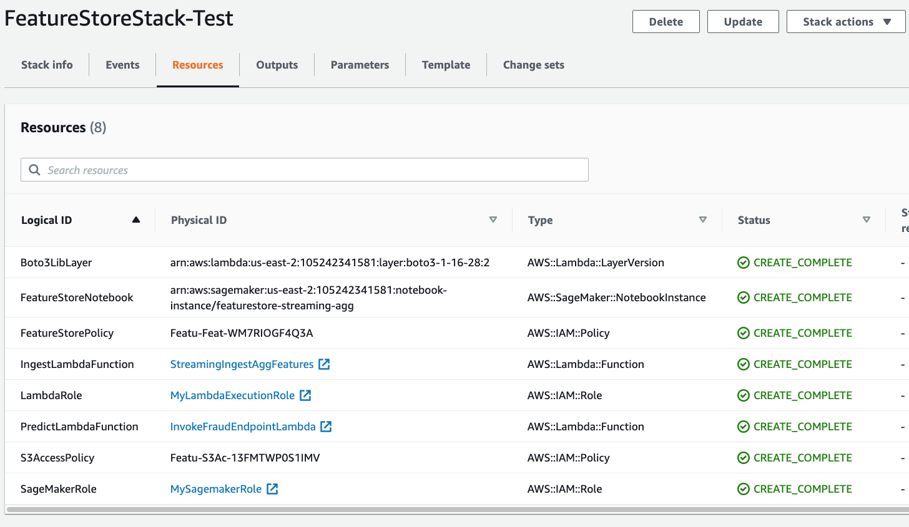

## Using Amazon SageMaker Feature Store with streaming feature aggregation

### Overview:
In this repository, we provide artifacts that demonstrate how to leverage Amazon SageMaker Feature Store and Kinesis Data Analytics for streaming feature aggregation. Our use case is Fraud Detection on credit card transactions. We use Amazon SageMaker to train a model (using the built-in XGBoost algorithm) with aggregate features created from historical credit card transactions. We use streaming aggregation with Amazon Kinesis and Amazon Kinesis Data Analytics (KDA) SQL, publishing features in near real time to SageMaker Feature Store. Finally, we pull the latest aggregate feature values from the feature store at inference time, passing them as input to our fraud detection model hosted in an Amazon SageMaker endpoint.

Here is a diagram showing the overall solution architecture:

For a full walkthrough of using streaming with a feature store, see this [blog post](https://aws.amazon.com/blogs/machine-learning/using-streaming-ingestion-with-amazon-sagemaker-feature-store-to-make-ml-backed-decisions-in-near-real-time/). It explains more about why customers in all industries are increasingly using streaming features in near real time, and gives additional insight about the solution architecture.

For a full explanation of SageMaker Feature Store you can read [here](https://aws.amazon.com/sagemaker/feature-store/), which describes the capability as:

Amazon SageMaker Feature Store is a purpose-built repository where you can store and access features so it’s much easier to name, organize, and reuse them across teams. SageMaker Feature Store provides a unified store for features during training and real-time inference without the need to write additional code or create manual processes to keep features consistent.

This implementation shows you how to do the following:

* Create multiple SageMaker Feature Groups to store aggregate data from a credit card dataset
* Run a SageMaker Processing Spark job to aggregate raw features and derive new features for model training
* Train a SageMaker XGBoost model and deploy it as an endpoint for real time inference
* Generate simulated credit card transactions sending them to Amazon Kinesis 
* Use KDA SQL to aggregate features in near real time, triggering a Lambda function to update feature values in an online-only feature group
* Trigger a Lambda function to invoke the SageMaker endpoint and detect fraudulent transactions

### Prerequisites

Prior to running the steps under Instructions, you will need access to an AWS Account where you have full Admin privileges. The CloudFormation template will deploy multiple AWS Lambda functions, IAM Roles, and a new SageMaker notebook instance with this repo already cloned. In addition, having basic knowledge of the following services will be valuable: Amazon Kinesis streams, Amazon Kinesis Data Analytics, Amazon SageMaker, AWS Lambda functions, Amazon IAM Roles.

### Instructions

1. Click 'Launch Stack' for the AWS region you want to deploy resources into

|AWS Region                |     Link        |
|:------------------------:|:-----------:|
|us-east-1 (N. Virgnia)    |  |
|us-east-2 (Ohio)          |  |
|us-west-1 (N. California) |  |
|eu-west-1 (Dublin)        |  |
|ap-northeast-1 (Tokyo)    |  |

To deploy the stack in other regions, you can [follow these instructions](./create_stack_in_other_regions.md). Please log an issue in this repo if you would like additional regions officially supported.

2. Click 'Next' for 'Specify template', 'Specify stack details', and 'Configure stack options'. On the 'Review' step, check the box that says 'I acknowledge that AWS CloudFormation might create IAM resources with custom names.' and then click 'Create Stack'. 

You can view the CloudFormation template directly by looking [here](./templates/sagemaker-featurestore-template.yaml). The stack will take a few minutes to launch. When it completes, you can view the items created by clicking on the Resources tab. Here is an example:

3. Once the stack is complete, browse to Amazon SageMaker in the AWS console and click on the 'Notebook Instances' tab on the left. 
4. Click either 'Jupyter' or 'JupyterLab' to access the SageMaker Notebook instance. The Cloudformation template has cloned this git repository into the notebook instance for you. All of the example code to work through is in the notebooks directory. 

**To use these notebooks from an existing SageMaker Studio domain, add a new Studio user and select the IAM role that was created by the CloudFormation stack. Open Studio for that new user, and git clone this repo. All other steps are the same.**
#### Running the Notebooks

There are a series of notebooks which should be run in order. Follow the step-by-step guide in each notebook:

* [notebooks/0_prepare_transactions_dataset.ipynb](./notebooks/0_prepare_transactions_dataset.ipynb) - generate synthetic dataset
* [notebooks/1_setup.ipynb](./notebooks/1_setup.ipynb) - create feature groups and Kinesis resources (can run this in parallel with notebook 0, no dependencies between them)
* [notebooks/2_batch_ingestion.ipynb](./notebooks/2_batch_ingestion.ipynb) - igest one-week aggregate features, and create training dataset
* [notebooks/3_train_and_deploy_model.ipynb](./notebooks/3_train_and_deploy_model.ipynb) - train and deploy fraud detection model
* [notebooks/4_streaming_predictions.ipynb](./notebooks/4_streaming_predictions.ipynb) - make fraud predictions on streaming transactions

#### Optional steps
- View the Kinesis Stream that is used to ingest records.
- View the Kinesis Data Analytics SQL query that pulls data from the stream.
- View the Lambda function that receives the initial kinesis events and writes to the FeatureStore.
- View the Lambda function that receives the final kinesis events and triggers the model prediction.

### **CLEAN UP - IMPORTANT**
To destroy the AWS resources created as part of this example, complete the following two steps:
1. Run all cells in [notebooks/5_cleanup.ipynb](./notebooks/5_cleanup.ipynb) 
2. Go to CloudFormation in the AWS console, select `sm-fs-streaming-agg-stack` and click 'Delete'.

## Security

See [CONTRIBUTING](CONTRIBUTING.md#security-issue-notifications) for more information.

## License

This library is licensed under the MIT-0 License. See the [LICENSE](./LICENSE) file.
